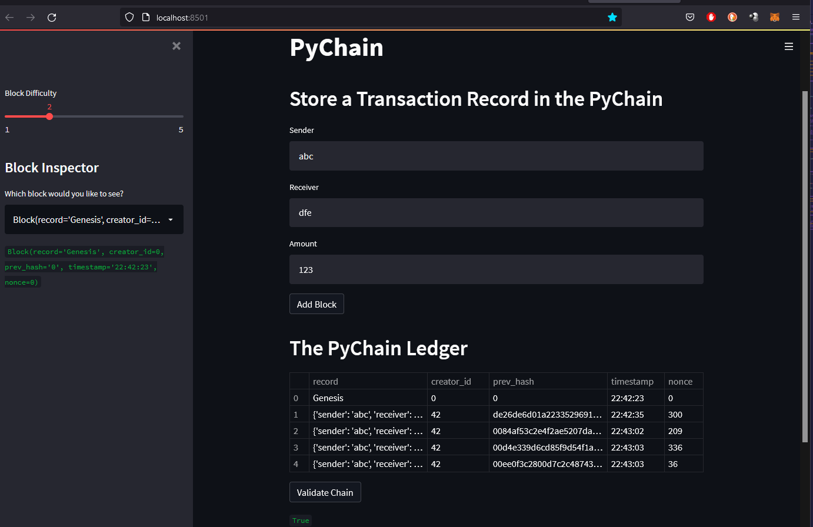

# fintech

this code uses pychain to build block data , in a chain, conessively, and then adds streamlit code for utilization.
it will allow you to input data for sender, receiver, and amount which will then be added to a block, and can be validated each time
neatly presenting in a web browser.

screens:
 

